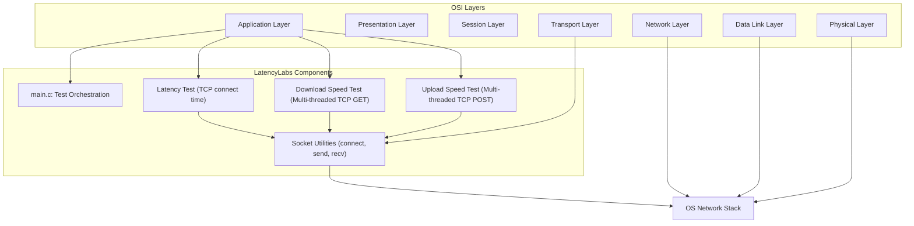

# LatencyLabs 🚀

A high-performance, multi-threaded internet speed testing tool written in C. LatencyLabs measures download speed, upload speed, and latency using parallel TCP connections and aggressive network optimizations.

## Features

- **Multi-threaded Testing**: Uses 8 parallel connections for maximum throughput
- **Accurate Measurements**: Microsecond-precision timing with `gettimeofday()`
- **TCP Optimizations**: 
  - TCP_NODELAY (Nagle's algorithm disabled)
  - Large socket buffers (2MB send/receive)
  - TCP_QUICKACK for faster ACKs (Linux)
  - High priority socket traffic
- **Real-time Progress**: Debug logging shows per-thread statistics
- **Minimal Dependencies**: Pure C with POSIX threads

## Performance

LatencyLabs achieves speeds comparable to commercial tools like Speedtest.net by using similar methodologies:
- Multiple parallel connections to saturate bandwidth
- Large transfer buffers (256KB) to minimize system calls
- Optimized TCP settings for low-latency, high-throughput transfers

## Prerequisites

- GCC compiler
- Linux/Unix system
- pthread library
- Standard C library

## Installation

```
git clone https://github.com/yourusername/LatencyLabs.git
cd LatencyLabs
make
```

## Project Structure

```architecture
LatencyLabs/
├── src/
│   ├── main.c          # Entry point and test orchestration
│   ├── speedtest.c     # Download/upload speed tests
│   └── network.c       # Socket utilities
├── include/
│   ├── speedtest.h     # Speed test function declarations
│   └── network.h       # Network utility declarations
├── obj/                # Build artifacts (generated)
├── Makefile            # Build configuration
└── README.md           # This file
```



## Usage

### Basic Usage

Run with default settings (Hetzner test server):
```
./latencylabs
```

### Custom Host

Test with a specific host for latency:
```
./latencylabs google.com
```

### Example Output

```
========================================
      LatencyLabs Speed Test
========================================

Testing latency to google.com...
✓ Latency: 8.34 ms

Testing download speed from ash-speed.hetzner.com (duration: 5 seconds)...
✓ Download Speed: 45.23 Mbps

Testing upload speed to httpbin.org (duration: 5 seconds)...
✓ Upload Speed: 35.67 Mbps

========================================
Test completed!
```

## How It Works

### Download Test
1. Creates 8 parallel TCP connections
2. Each thread downloads 100MB test file from the server
3. Skips HTTP headers and measures only data transfer
4. Aggregates results from all threads
5. Calculates total throughput in Mbps

### Upload Test
1. Creates 8 parallel TCP connections
2. Each thread uploads 256KB chunks via POST request
3. Continues uploading until duration expires
4. Aggregates results from all threads
5. Calculates total throughput in Mbps

### Latency Test
1. Establishes TCP connection to target host
2. Measures round-trip time (RTT) in milliseconds
3. Uses microsecond precision timing

## Configuration

### Change Test Servers

Edit `src/main.c` to modify test endpoints:

```
const char *download_host = "ash-speed.hetzner.com";  // Download test server
const char *upload_host = "httpbin.org";              // Upload test server
```

### Adjust Test Duration

Modify the duration in `src/main.c`:

```
int test_duration = 5;  // Default: 5 seconds
```

### Change Number of Threads

Edit `NUM_THREADS` in `src/speedtest.c`:

```
const int NUM_THREADS = 8;  // Default: 8 parallel connections
```

## Troubleshooting

### Low Download Speeds

1. **Try a different server**: Hetzner may be geographically far from you
   ```
   const char *download_host = "cachefly.cachefly.net";
   ```
   Update GET path in speedtest.c: `GET /100mb.test`

2. **Enable TCP BBR** (Linux only):
   ```
   echo "net.core.default_qdisc=fq" | sudo tee -a /etc/sysctl.conf
   echo "net.ipv4.tcp_congestion_control=bbr" | sudo tee -a /etc/sysctl.conf
   sudo sysctl -p
   ```

3. **Increase system TCP buffers**:
   ```
   echo "net.core.rmem_max=16777216" | sudo tee -a /etc/sysctl.conf
   echo "net.core.wmem_max=16777216" | sudo tee -a /etc/sysctl.conf
   sudo sysctl -p
   ```

### Debug Logging

All debug information is sent to stderr. To view:
```
./latencylabs 2>&1 | less
```

To hide debug logs:
```
./latencylabs 2>/dev/null
```

To save debug logs:
```
./latencylabs 2>debug.log
```

## Technical Details

### Socket Optimizations

- **TCP_NODELAY**: Disables Nagle's algorithm for lower latency
- **Large buffers**: 2MB socket buffers, 256KB transfer buffers
- **TCP_QUICKACK**: Enables quick ACK mode on Linux
- **SO_PRIORITY**: Sets high priority for socket traffic

### Threading Model

- Uses POSIX threads (pthread)
- Each thread operates independently
- Results are aggregated after all threads complete
- Thread-safe with separate buffers per thread

## Makefile Targets

```
make           # Build the project
make clean     # Remove build artifacts
make run       # Build and run
```

## Dependencies

- **gcc**: GNU C Compiler
- **pthread**: POSIX threads library
- **math**: Math library (`-lm`)

## Limitations

- Requires active internet connection
- Performance depends on network quality and server location
- Upload test requires server that accepts POST requests
- Some optimizations are Linux-specific (TCP_QUICKACK)

## Acknowledgments

- Inspired by Ookla Speedtest methodology
- Uses test files from Hetzner and other CDN providers
- Thanks to the open-source community for testing and feedback
